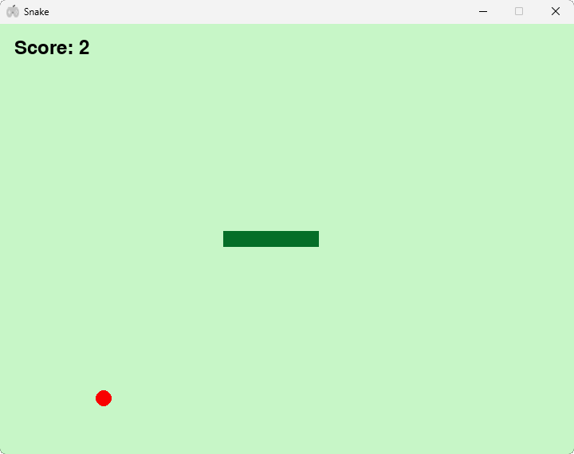

# Minigames Hub

This is a minigames hub made with python and the customtkinter module, featuring popular games such as TicTacToe, Hangman, Snake and Gamele. We are hoping to improve this project massively over time and soon introducing a completely new game, Gamele, guess the video game character, styled similarly to games such as Wordle.

# Games and Features
TicTacToe:
  - 2 player mode, player one is X and player two is O
  - AI with difficulty choosing *to be implemented*

Hangman:
  - Restart or Quit if you lose
  - Hints *to be implemented*

Snake:
  - Great sound effects for feedback
  - Increasing difficulty as game progresses

Gamele:
  - Guess the video game character
  - Styled similarly to games such as Wordle
  - Based on web technologies
  - Over 500 different characters, including obscure and well popular ones
  - *COMING SOON*

Other:
  - Stylish icons
  - Button press sound feedback   

## Screenshots

#### Menu

#### TicTacToe

#### Hangman

#### Snake

#### Gamele

