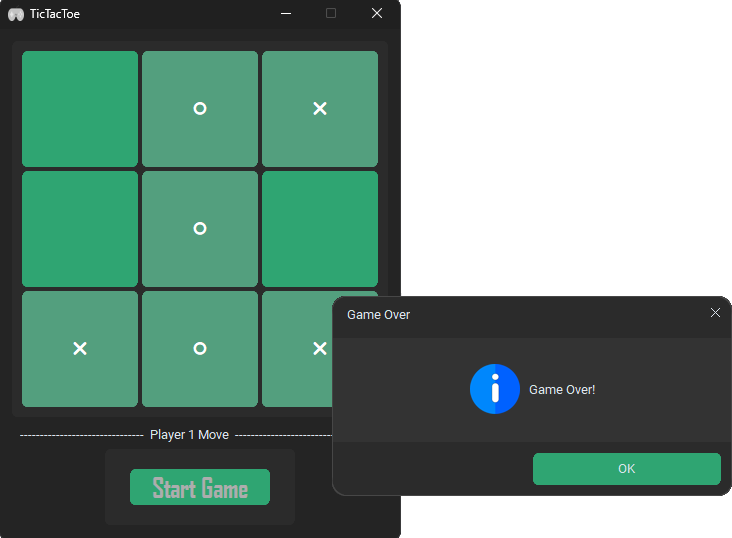

# Minigames Hub

This is a minigames hub made with python and the customtkinter module. Currently, TicTacToe is in development and Hangman is completed. This project is a collaboration with @kambains226, and we are planning to add two more games, Snake and Pong.

# Games and Features
TicTacToe:
  - Choose your difficulty (Begginer, Intermediate, Impossible)
  - Choose who moves first (Me, The AI, Random)
Hangman:
  - Restart or Quit if you lose
  - Hints *(to be implemented)*
Other:
  - Stylish icons
  - Button press sound feedback

## Screenshots

#### Menu

#### TicTacToe

#### Hanfman
